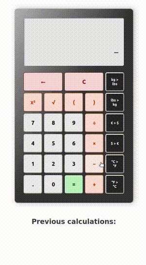

# JS Calculator

## Preview

## Features

**Functionalities**

- **Keyboard support** (including / in Firefox)
- Brackets, powers, square roots
- **Clear** and **backspace** options
- **Currency converter** (currency rates fetched **from an API**), weight converter, temperature converter
- Multiplication when no operator is given before or after brackets and before square roots *(e.g.: (1+2)3 = (1+2)\*3)*
- **Logs** of the previous calculations
- **Navigation with up and down** arrows in the previous calculations
- Entering a number after typing or pressing "=" starts a new calculation (removes the one currently on the screen)

**Bug-proof**

- Doesn't allow multiple operators one after the other *(no "3++\*5")*
- Adding a 0 before a decimal point at the start, or after an operator *(e.g.: "3+0.1", not "3+.1")*
- Only one decimal point allowed per number
- No "=" allowed right after an operator, or if the calculator screen is empty

## Cosmetics

- Basic CSS layout
- Basic responsiveness
- Hover and focus states
- Keypress effects

## Shortcomings

- This uses loads of Regex, which means that recursive expressions are not possible. Thus, expressions such as "*(2\*(2+3))^(2^(2\*(2-4)))*" (with nested parentheses and/or powers of powers) will break the poor machine. Please be gentle with it.
- Long expressions wider than the calculator screen are stuck to the left, so you don't see the last characters. I tried adding `direction: rtl;` in the CSS, but this messes with the operation.